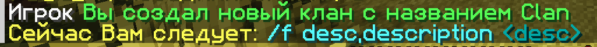
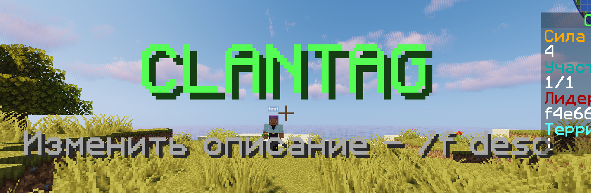
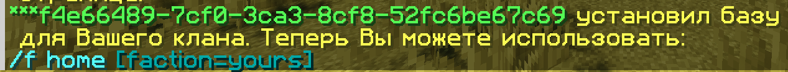
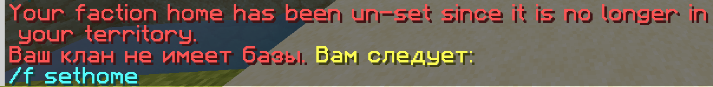
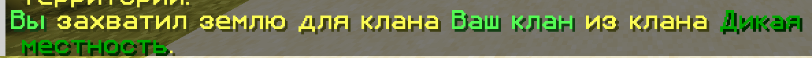

# ⚔ Кланы: описание, команды и функции

## Введение

Клан - это группа игроков, как команда или клуб. Клан может претендовать на территорию, совместно строить базу и строить (или разрушать) отношения с другими кланами.

Преимущества кланов:

* Захваченная Вами территория полностью защищена от других игроков
* Вы можете захватить территорию других игроков, победив их в битве
* Бесплатное создание
* Кастомные титулы для игроков, 5 различных рангов
* Множество комманд для управления

## Территория

Клан захватывает землю **по чанкам**, в зависимости от того, сколько единиц силы он имеет, из расчета **1 чанк на 1 единицу силы**. На своей территории члены клана могут строить исключительно без вмешательства других членов (настраивается с помощью команды /f perms). Территория клана - это место, где вы можете построить свою базу, установить местоположение дома клана, создать варпы и многое другое.

## Сила

Каждый игрок обладает определенным количеством "силы". Новый игрок обычно начинает с 0 силы и медленно набирает силу со временем, играя на сервере. При смерти игрок теряет определенное количество силы.

Когда игрок входит в состав клана, сила его клана рассчитывается как общая сила игроков. **Сила** - это то, как кланы приобретают территорию или совершают набеги на другой клан. Клан может занимать территорию до тех пор, пока ее сила больше, чем ее текущее количество занятых чанков.

Если в результате смерти игроков или ухода игроков из клана количество территорий превышает силу, на клан могут совершить набег враги, которые теперь могут разрушать блоки на территории противника и, возможно, даже захватить территории, находящиеся за пределами клана.

## Создание клана

Как говорилось выше - создание клана абсолютно **БЕСПЛАТНО**

* `/f create название` - создать клан.


**Правила кланов**

1. В названии клана не должно быть выражений, унижающие человеческое достоинство, разжигающие межнациональную рознь, оскорбления в адрес других игроков, нецензурные выражения в любом виде, даже на других языках, символов и слов, носящих сексуальный характер и т.д.
2. В случае перманентной блокировки владельца клана, ему даётся последнее действие по передаче клана другому игроку


После создания клана Вы сможете приглашать в него других игроков. **За каждого члена** клана (в том числе и Вас) Ваш клан получает **8 единиц силы**. О силе, ее применении и способах получения мы поговорим далее.

<figure><figcaption>
Сообщение в чате о создании клана
</figcaption></figure>

## Изменение названия клана

В любой момент Вы можете изменить название своего клана, используя следующую команду:

* `/f tag новое название` - изменить название клана.

После использования команды Вы получите следующее сообщение в чате:


<mark style="color:red;">**Внимание!**</mark>

1. **Название клана НЕ ДОЛЖНО содержать спец. символов, пробелов и точек.**
2. **Название клана НЕ ДОЛЖНО быть длиннее 10 символов**


В случае нарушения какого-либо правила, в чате появится сообщение:

<figure><figcaption>
Сообщения об ошибках при указании неподходящего названия клана
</figcaption></figure>

## Приглашение игрока в клан

После создания клана Вы, возможно, захотите пригласить в него своих друзей. Сделать это Вы можете используя следующую команду:

* `/f invite ник` - пригласить игрока в клан.

У приглашенного игрока в чате появится уведомление о том, что Вы пригласили его в свой клан:

Приглашенному игроку следует нажать на сообщение в чате, и приглашение будет принято.

<figure><figcaption>
Сообщение о приглашении в клан в чате игрока
</figcaption></figure>

## Изменение описания клана

* `/f desc опиание` - изменить описание клана.

После того, как Вы заприватите свой первый чанк, при входе в него у Вас на экране будет отображаться название Вашего клана и его описание:

<figure><figcaption>
Название и описание клана отображается при входе на территорию 
</figcaption></figure>

После использования команды, описание клана изменится, и при входе на территорию будет отображатся новое описание:

<figure><figcaption>
Сообщение об удачном изменении описания
</figcaption></figure>

## Установка базы клана

На территории своего клана Вы можете установить базу, на которую сможете телепортироваться.

Базу клана можно установить используя следующую команду:

* `/f sethome` - установка базы клана.

После использования команды Вы получите следующее сообщение в чате:

<figure><figcaption>
Сообщение о том, что Вы успешно установили базу клана
</figcaption></figure>

Однако, если Вы установите базу своего клана на территории ДРУГОГО клана - Вы не сможете телепортироваться на неё.

<figure><figcaption>
Сообщение с ошибков
</figcaption></figure>

## Захват территории

Захватывая территорию Вы автоматически "приватите" её, то есть только члены Вашего клана имеют право разрушать, строить, использовать рычаги, кнопки и т.п. на этой территории.

Чтобы захватить 1 чанк территории используйте следующую команду:

* `/f claim` - захватить 1 чанк территории.

По умолчанию 1 игрок имеет 8 единиц силы (`1 единица силы = 1 чанк`), то есть после создания клана Вы можете заприватить 8 чанков. Пригласив в клан своего друга, вы сможете заприватить уже 16 чанков, и так по нарастающей.

Если захват прошел удачно, Вы получите следующее сообщение в чате:

<figure><figcaption>
Сообщение о захвате территории в чате
</figcaption></figure>

## Отношения с другими кланами

Есть 3 типа отношений с другими кланами:

* `Нейтральные` - neutral,
* `Союзные` - ally,
* `Вражеские` - enemy.

Установить отношения Вы можете используя следующие команды:

* `/f ally название` - стать союзниками с кланом.
* `/f enemy название` - стать врагами с кланом.
* `/f neutral название` - установить нейтральные отношения.

Пример использования команды:

<figure><figcaption>
Сообщение о том, что Ваш клан желает стать союзником с другим кланом
</figcaption></figure>

**ОБА** клана должны установить отношения между собой. Если Вы решили установить какие-либо отношения с другим кланом - им придет уведомление о Вашем намерении, и им решать, каким отношениям быть.

## Распустить клан

В любой момент лидер клана может распустить его. Следать это он может используя следующую команду:

* `/f disband` - распустить клан.

После использования команды Вы увидете следующее сообщение:

<figure><figcaption>
Сообщение об удалении клана
</figcaption></figure>

## Команды

* `/f join` - стать членом открытого клана.
* `/f leave` - покинуть клан.
* `/f chat` - изменить канал чата:


Каналы чата:

`public` - общий чат,

`alliance` - чат союза,

`faction` - чат клана,

`truce` - чат перемирия.


* `/f announce` - сделать объявление для членов клана.
* `/f open` - открыть клан.
* `/f deinvite` - открывает список приглашений. В списке Вы можете отозвать приглашения.
* `/f title ник титул` - установить титул игроку (он ни на что не влияет, исключительно декоративная вещичка).
* `/f promote` - повысить игрока на 1 ранг.
* `/f demote` - понизить игрока на 1 ранг.
* `/f mod` - сделать игрока ветераном клана.
* `/f coleader` - сделать игрока со-владельцем клана.
* `/f admin` - передать игроку статус лидера.
* `/f kick` - исключить игрока из клана.
* `/f ban` - забанить игрока в клане.
* `/f unban` - разбанить игрока.
* `/f banlist` - открыть список заблокированных игроков.
